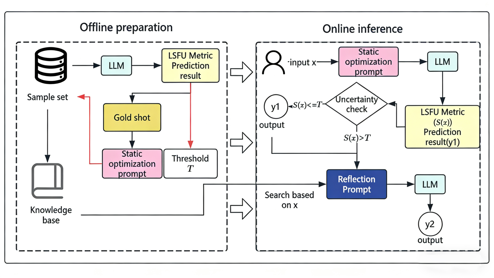

# 🚀 UCPOF: Uncertainty-Calibrated Prompt Optimization Framework

 

> **[English]** | [[中文文档](README_zh-CN.md)]

## 💡 About The Project

While Retrieval-Augmented Generation (RAG) significantly enhances LLM performance, the indiscriminate use of "always-on" RAG in high-concurrency industrial settings introduces severe Database QPS pressure, high inference latency, and excessive token costs.

**UCPOF** is an adaptive, uncertainty-aware framework designed to solve this. By introducing a novel metric—**Log-Scale Focal Uncertainty (LSFU)**—UCPOF accurately identifies when an LLM is truly confused versus when it is just exhibiting "spurious confidence" driven by pre-training priors. It acts as an intelligent gate, triggering RAG **only for high-risk samples**, reducing retrieval overhead by **50.66%** while boosting accuracy by **5.75%** over always-on RAG.

<p align="center">
  <!-- 建议在这里放一张你论文的 Figure 1 框架图 -->
  
</p>

## ✨ Core Contributions

- **Log-Scale Focal Uncertainty (LSFU):** A training-free, first-token-based confidence metric calibrated with label priors.
- **Gold-Shot Selection:** A static prompt optimization strategy that selects the most stable and reliable exemplars.
- **Adaptive RAG Gating:** Intelligently balances cost and accuracy, achieving Pareto-optimal efficiency.
- **Plug-and-Play:** Easily adaptable to multiple open-source LLMs (Qwen, LLaMA, ChatGLM) and custom datasets.

---

## 🛠️ Installation

```bash
# 1. Clone the repository
git clone https://github.com/ju-sir/UCPOF.git
cd UCPOF

# 2. Create a virtual environment (optional but recommended)
conda create -n ucpof python=3.9
conda activate ucpof

# 3. Install dependencies
pip install -r requirements.txt
```

---

## 🚀 Quick Start (Applying UCPOF to Your Data)

We decouple configurations from the code. You can easily adapt UCPOF to your own tasks by modifying the YAML configs.

### 1. Configure your Dataset & Model
Check `configs/dataset/ace.yaml` and `configs/model/qwen_7b.yaml` to set your data paths, label spaces, and model paths.

### 2. Extract Features (Offline Phase)
First, extract features for each data sample, including LSFU scores, and save them to a CSV file:
```bash
python scripts/extract_features.py \
    --dataset_config configs/dataset/ace.yaml \
    --model_config configs/model/qwen_7b.yaml \
    --output_dir ./outputs
```
*This script calculates LSFU scores and other metrics for each sample and saves them to a CSV file for further analysis.*

### 3. Run the full UCPOF Pipeline
After extracting features, run the complete UCPOF pipeline for online inference:
```bash
python scripts/run_ucpof.py \
    --dataset_config configs/dataset/ace.yaml \
    --model_config configs/model/qwen_7b.yaml \
    --output_dir ./outputs
```
*This script uses the extracted features to perform adaptive RAG inference, balancing cost and accuracy.*

---

## 📊 Analyzing Results

After running the pipeline, you can analyze the results to obtain specific metric values:

### Performance Analysis
To analyze the performance metrics and generate visualizations:
```bash
python analysis/plot_pareto_efficiency.py --csv_path outputs/results.csv
python analysis/plot_risk_coverage.py --csv_path outputs/results.csv
python analysis/plot_kde_distribution.py --csv_path outputs/results.csv
```

### Ablation Analysis
To analyze the impact of different components on performance:
```bash
python scripts/run_ablation.py --config configs/experiment/ablation.yaml
```

---

## 📁 Repository Structure

```text
UCPOF/
├── configs/            # ⚙️ YAML configs for datasets and models
├── data/               # 📂 Data directory (instructions to download ACE, AGNews, etc.)
├── src/                # 🧠 Core source code (Metric, Retriever, Prompt Manager, Pipeline)
├── analysis/           # 📈 Scripts for plotting figures (Pareto, KDE, Risk-Coverage)
├── scripts/            # 🏃‍♂️ Entry scripts for execution
└── README.md           
```

## 📖 Acknowledgments

We would like to thank the open-source community for their valuable contributions to the tools and libraries used in this project.

## 📄 License
This project is licensed under the MIT License - see the [LICENSE](LICENSE) file for details.